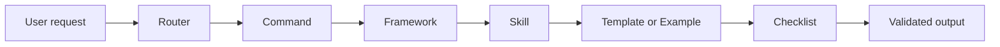

# AI Engineer Pack

A professional knowledge base for AI-assisted software engineering. The pack organizes prompts, workflows, skills, templates, checklists, examples, and validation tooling so ChatGPT, Codex, GitHub Copilot, OpenAI Agents, and future AI coding assistants can work from shared context.

[Explore Skills](SKILL_INDEX.md){ .md-button .md-button--primary }
[Run Validation](SUMMARY.md){ .md-button }

## What this site contains

<div class="grid cards" markdown>

-   **Agents**

    Modern AI agent knowledge base covering OpenAI Agents SDK, LangGraph, CrewAI, AutoGen, Claude Code, GitHub Copilot, Gemini CLI, and multi-agent architecture patterns.

    [Open the Agent Index](AGENT_INDEX.md)

-   **Model Context Protocol**

    MCP knowledge base covering clients, servers, resources, tools, transport, security, templates, examples, and production best practices for OpenAI, Claude, and agent integrations.

    [Open the MCP Index](MCP_INDEX.md)

-   **Skills**

    Technology-specific playbooks for languages, web frameworks, CMS platforms, databases, DevOps, cloud, AI, machine learning, security, embedded, mobile, architecture, testing, documentation, review, and debugging.

    [Open the Skill Index](SKILL_INDEX.md)

-   **Frameworks**

    Prompt engineering methodologies such as CO-STAR, RISE, CRISPE, BAB, CARE, ReAct, Tree of Thought, Chain of Thought, Plan and Solve, Self-Refine, Reflection, Skeleton of Thought, Least-to-Most, and Reverse Prompting.

    [Open the Framework Index](FRAMEWORK_INDEX.md)

-   **Commands**

    Reusable workflows for build, review, debug, refactor, test, deploy, learn, design, document, and optimize tasks.

    [Open the Command Index](COMMAND_INDEX.md)

-   **Templates and Checklists**

    Starter structures and quality gates for common engineering projects, releases, reviews, documentation, security, testing, and architecture decisions.

    [Open Templates](TEMPLATE_INDEX.md) · [Open Checklists](CHECKLIST_INDEX.md)

</div>

## Repository workflow



## How to use the pack

1. Start with the [Documentation Summary](SUMMARY.md) to understand the repository layout.
2. Choose a task workflow from the [Command Index](COMMAND_INDEX.md).
3. Pair it with a reasoning or communication method from the [Framework Index](FRAMEWORK_INDEX.md).
4. Select the right domain or technology from the [Skill Index](SKILL_INDEX.md).
5. Use [Templates](TEMPLATE_INDEX.md), [Checklists](CHECKLIST_INDEX.md), and [Examples](EXAMPLE_INDEX.md) to create and verify the final artifact.
6. Run the validation toolkit before publishing changes.

## Validation toolkit

The repository includes Python 3.11+ validation scripts under `scripts/`.

```bash
pip install -r requirements-docs.txt
mkdocs serve

python scripts/validate.py
python scripts/check_links.py
python scripts/check_placeholders.py
python scripts/generate_index.py
python scripts/build_docs.py
python scripts/search.py wordpress
```

The validator checks Markdown files, links, placeholders, missing README files, required skill files, repository structure, duplicate files, empty files, naming conventions, Python imports, and repository statistics.

## Primary indexes

| Area | Purpose |
|---|---|
| [System](SYSTEM_INDEX.md) | Operating principles, quality standards, security rules, output format, and assistant behavior guidance. |
| [Agents](AGENT_INDEX.md) | Agent SDKs, coding agents, CLI agents, GitHub-native agents, and multi-agent system patterns. |
| [MCP](MCP_INDEX.md) | Model Context Protocol clients, servers, resources, tools, transport, security, examples, templates, and best practices. |
| [Skills](SKILL_INDEX.md) | Domain and technology playbooks for AI-assisted engineering. |
| [Frameworks](FRAMEWORK_INDEX.md) | Prompt methodologies for communication, reasoning, planning, and critique. |
| [Commands](COMMAND_INDEX.md) | Repeatable workflows for common engineering actions. |
| [Templates](TEMPLATE_INDEX.md) | Starter structures for APIs, apps, CMS plugins, embedded projects, ML, RAG, CLI, Docker, and GitHub Actions. |
| [Checklists](CHECKLIST_INDEX.md) | Completion criteria for review, security, testing, deployment, performance, accessibility, documentation, release, and architecture. |
| [Examples](EXAMPLE_INDEX.md) | Applied scenarios that combine pack resources. |

## Maintainer notes

- Use [CONTRIBUTING.md](CONTRIBUTING.md) before changing pack structure or generated pages.
- Regenerate indexes after adding skills, frameworks, commands, templates, checklists, examples, or system files.
- Keep this site focused on the current repository structure; do not duplicate source documentation unless a generated index needs to expose it.


