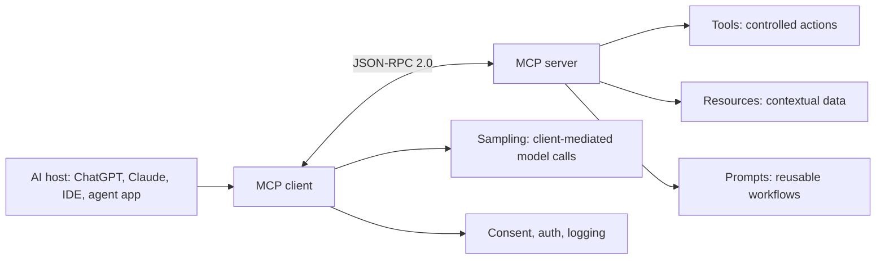

# Model Context Protocol Module

## Purpose
The `mcp` module is a production-quality knowledge base for Model Context Protocol engineering. It covers MCP fundamentals, JSON-RPC, tools, resources, prompts, sampling, transport, authentication, authorization, security, server development, client development, debugging, testing, deployment, performance, OpenAI integration, Claude integration, and real-world implementation patterns.

## What MCP is
Model Context Protocol is an open standard for connecting AI applications to external systems. MCP uses JSON-RPC 2.0 messages between hosts, clients, and servers so AI systems can discover and use contextual data, executable tools, reusable prompts, and controlled workflow capabilities through a common interface.

## Core concepts
- **Hosts** are applications such as ChatGPT-style products, Claude Desktop, Claude Code, IDEs, or agent platforms that present AI capabilities to users.
- **Clients** maintain MCP sessions, discover capabilities, enforce host policy, and mediate user consent.
- **Servers** expose tools, resources, prompts, and other capabilities for a specific external system or workflow domain.
- **Tools** are executable actions with schemas, side effects, permissions, and structured results.
- **Resources** are URI-addressed context objects such as files, records, documentation, logs, or metrics.
- **Prompts** are reusable prompt templates or task starters exposed by a server.
- **Sampling** lets a server request model assistance through a client-controlled path instead of independently selecting a model.
- **Transport** carries JSON-RPC 2.0 messages over stdio or Streamable HTTP, depending on local or remote deployment needs.

## Contents
- [MCP Index](MCP_INDEX.md)
- [Clients](clients/README.md)
- [Servers](servers/README.md)
- [Resources](resources/README.md)
- [Tools](tools/README.md)
- [Transport](transport/README.md)
- [Security](security/README.md)
- [Examples](examples/README.md)
- [Templates](templates/README.md)
- [Best Practices](best-practices/README.md)

## Architecture at a glance

## OpenAI integration
OpenAI agent and tool workflows can use MCP servers as external capability providers. Treat each MCP server as a privileged integration: verify server identity, constrain exposed tools and resources, review descriptions for safety, require approval for side effects, and preserve call provenance in logs and user-visible results.

## Claude integration
Claude and Claude Code workflows use MCP to connect AI sessions with local and remote tools, files, services, and developer environments. Keep server configuration explicit, apply least privilege, document reachable workspace or account data, and require confirmation before writes or deployments.

## Production guidance
- Design resources before tools when the model primarily needs context.
- Keep tool schemas narrow and result objects structured.
- Use JSON-RPC contract tests for initialization, discovery, calls, errors, cancellation, and notifications.
- Enforce authorization on the server even when the client also has policy controls.
- Treat tool and resource output as untrusted content that can influence model behavior.
- Monitor latency, error rate, payload size, token impact, and capability usage.

## Related repository modules
- [Agents](../agents/README.md)
- [AI skills](../skills/ai/README.md)
- [Security skills](../skills/security/README.md)
- [Architecture skills](../skills/architecture/README.md)
- [ReAct framework](../frameworks/react/README.md)
- [Plan and Solve framework](../frameworks/plan-and-solve/README.md)
- [Microservice template](../templates/microservice/README.md)
- [GitHub Action template](../templates/github-action/README.md)
