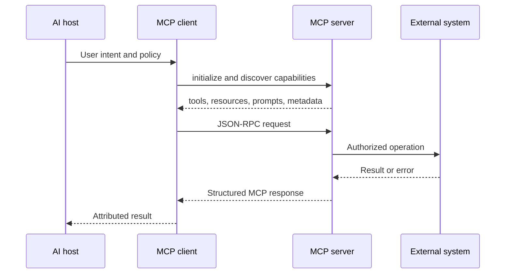

# MCP Examples Architecture

## Purpose
This document explains the architecture decisions behind mcp examples in the MCP module.

## Component model
- release readiness
- support triage
- developer workflows
- OpenAI agents
- Claude Code
- Hosts own user experience, policy, identity context, and approval surfaces.
- Clients maintain MCP sessions, discover capabilities, and mediate model access.
- Servers expose resources, tools, prompts, and optional sampling workflows for a defined external system.
- External systems remain behind server-side validation, authorization, and audit controls.

## JSON-RPC responsibilities
- MCP uses JSON-RPC 2.0 requests, responses, notifications, and errors.
- Initialization negotiates protocol version and advertised capabilities before work begins.
- Capability descriptions are part of the security surface because the model can reason from them.
- Cancellation, timeouts, malformed payloads, and unknown methods need predictable error behavior.

## Data and control flow

## Design tradeoffs
- Narrow capabilities are easier to secure and evaluate, but may require more explicit orchestration.
- Rich result payloads reduce follow-up calls, but can increase context cost and leakage risk.
- Local transports improve developer ergonomics, while remote transports need stronger identity, rate limiting, and operational controls.
- Prompt, tool, and resource content can improve model accuracy, but returned content must be treated as untrusted context.

## Related modules
- [Clients](../clients/README.md)
- [Servers](../servers/README.md)
- [Transport](../transport/README.md)
- [Security](../security/README.md)
- [Best Practices](../best-practices/README.md)
